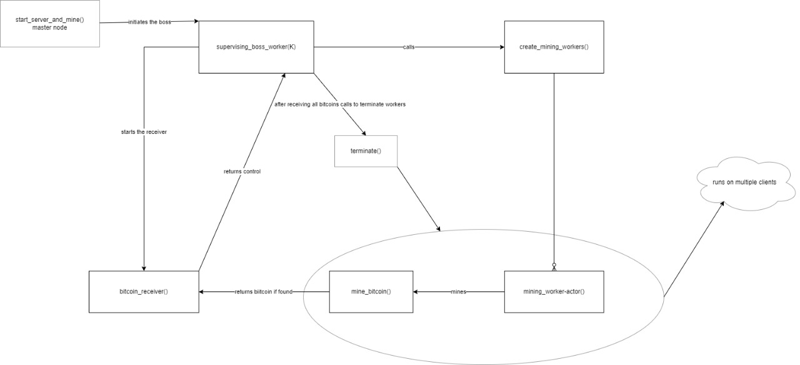
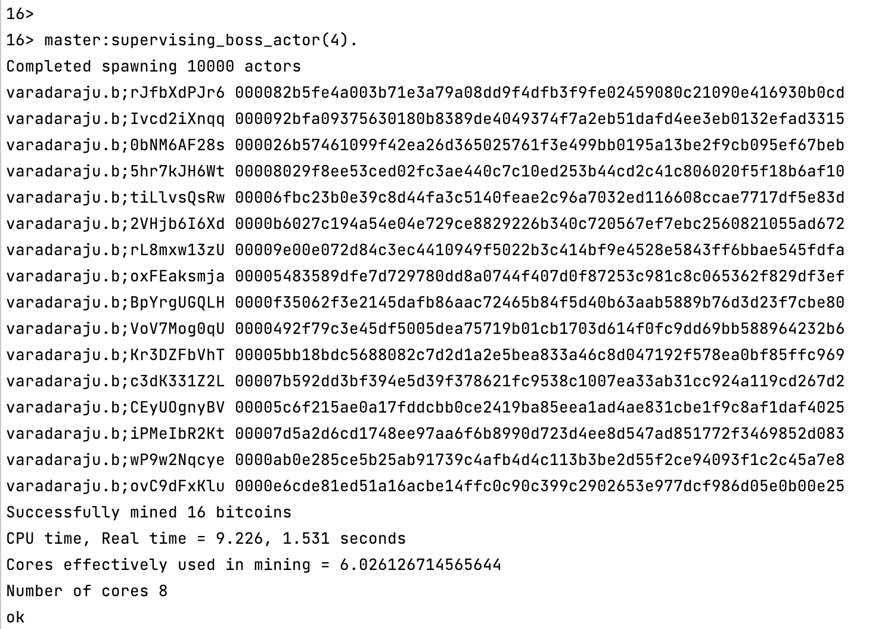
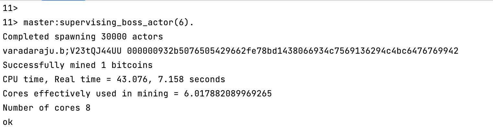

## Bitcoin Mining Using Erlang

This project utilises actor model architecture for simulating bitcoin mining.

#### Team members

1. Bhagya Raj Varadaraju, UFID: 60212561, varadaraju.b@ufl.edu
2. Sharath Kumar Raju Addepalli, UFID: 33589528, s.addepalli@ufl.edu

#### Architecture

The server will start mining and wait for any connect requests from clients
for every 50 spawns. If connect is received, the client's node name will be
appended to the workers list and the spawning is continued. Before each spawn,
we select a random node from the list and spawn actor using that node. After all
the actors are spawned successfully, boss actor terminated all the connected workers.

#### How to execute for using a single erlang node:
First enter into erlang shell using 'erl'\
1> master:start_server_and_mine(K, "ServerIP").\
eg: 1> master:start_server_and_mine(5, "192.168.0.66").

#### How to execute for using multiple erlang nodes:
First enter into erlang shell for server using 'erl'\
Compile the all the three modules as below\
1> c(utils).\
{ok,utils}\
2> c(miner).\
{ok,miner}\
3> c(master).\
{ok,master}

Then we have to start the server as below before starting any clients\
1> master:start_server_and_mine(K, "ServerIP").\
eg: 1> master:start_server_and_mine(5, "192.168.0.66").

Then copy miner.erl file to other client systems or execute in the same system\
Then enter into erlang shell for all clients using 'erl'
1> miner:connect_to_server("ClientIP", "ServerIP").\
eg: miner:connect_to_server("192.168.0.69", "192.168.0.66").

#### Answers

1. Size of the work unit that you determined results in the best performance for your implementation and an explanation
   of how you determined it. The size of the work unit refers to the number of sub-problems that a worker gets in a
   single request from the boss.\

_We experimented with 'K = 5' and work unit values 50, 100, 250, 500, 1000. The (wall clock time, cores used) 
for all these executions are as follows: (4.35 sec, 2.4593), (4.448 sec, 4.1573), (8.212 sec, 5.994033122260107),
(16.867 sec, 6.0516), (34.31 sec, 6.0862)_

_Since the number of used is peaking around the work unit 250 and stagnated after, we choose
250 as our work unit. Also the execution real time is ideal for the extracted amount of bitcoins._

2. The result of running your program for input 4\
_Check the below screenshot for the output with K = 4_
   
   
3. The running time for the above is reported by time for the above and report the time. The ratio of CPU time to REAL
   TIME tells you how many cores were effectively used in the computation. If you are close to 1 you have almost no
   parallelism (points will be subtracted).\
_No of cores effectively used in the computation is approximately equal to 6.0._

4. The coin with the most 0s you managed to find.\
_We were able to mine a bitcoin with 6 leading zeroes. See the below output_
   

5. The largest number of working machines you were able to run your code with.\
_We ran our code with utmost two nodes i.e, two erlang systems._ 